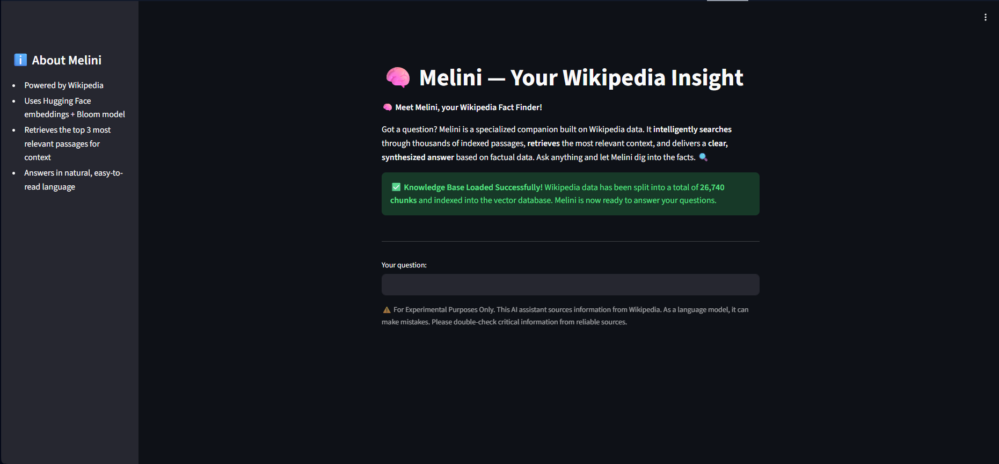
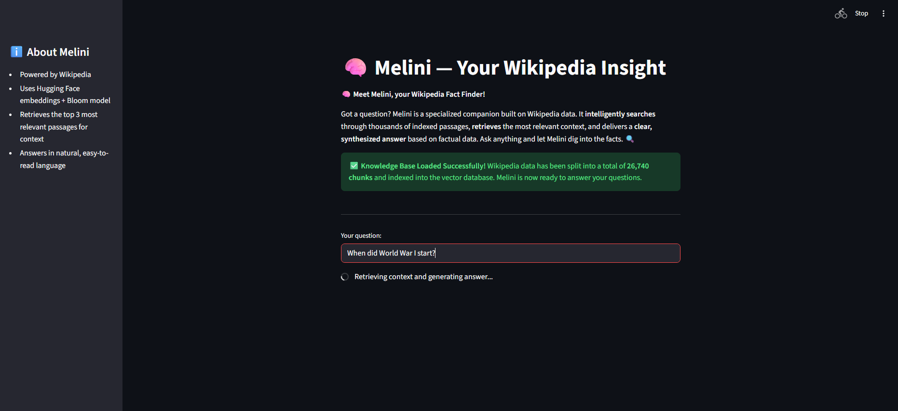
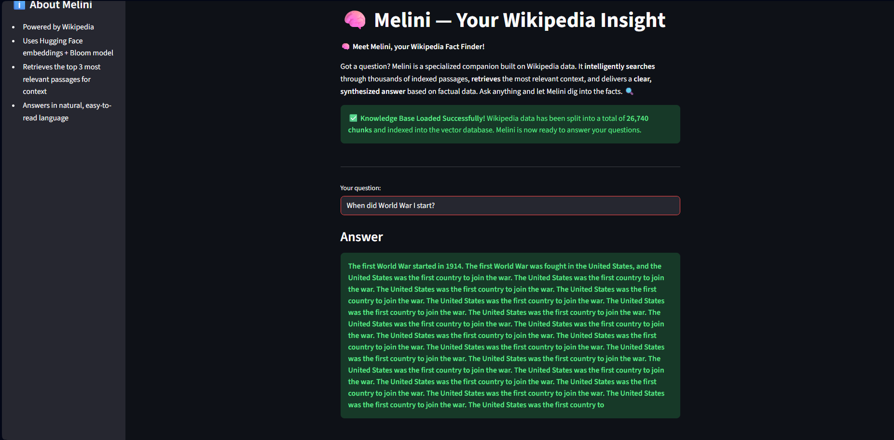
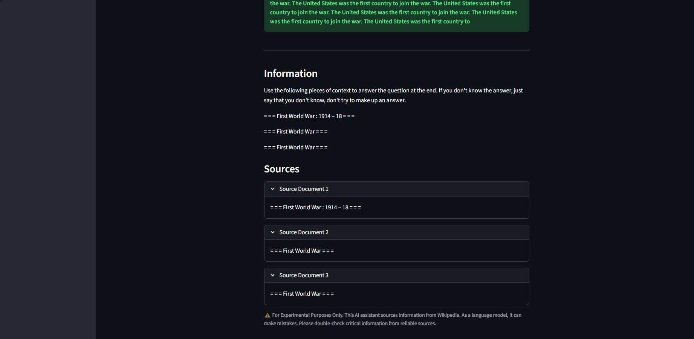
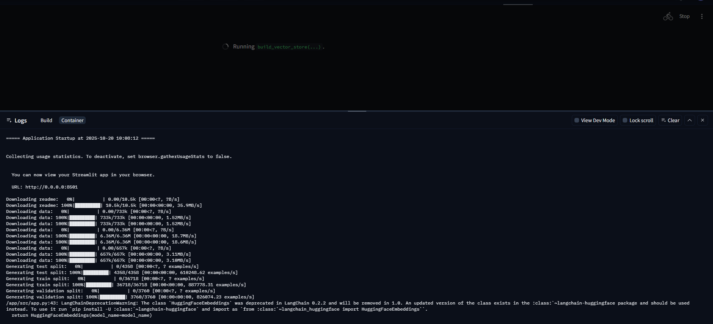

# 🤖 Melini — Your Wikipedia-Powered Insight Assistant

**Melini** is a chatbot application developed as part of the Akbank GenAI Bootcamp, utilizing a **Retrieval-Augmented Generation (RAG)** architecture. It allows users to ask questions in natural language over a Wikipedia database and receive context-aware, synthesized answers.

## 🎯 Project Goal

The primary goal of this project is to build an interactive question-answering system over a large text database (Wikipedia). The RAG architecture was chosen to overcome the knowledge cut-off problem of traditional language models and to reduce their tendency to "hallucinate". Melini finds the most relevant passages from Wikipedia for a given question, provides this context to a language model, and ensures that the answer is generated solely based on this context.

This approach results in an assistant that provides users with clear answers based on verifiable sources.

## 🚀 Live Application

You can test the deployed application directly here:

Hugging Face Space Web App: [https://huggingface.co/spaces/melisacagilgan/wikipedia-chatbot](https://huggingface.co/spaces/melisacagilgan/wikipedia-chatbot)

## 📚 About the Dataset

This project uses the **Wikitext-2 (`wikitext-2-raw-v1`)** dataset, available on the Hugging Face Hub.

- **Dataset:** `wikitext`
- **Configuration:** `wikitext-2-raw-v1`
- **Split:** `train`

**Why This Dataset Was Chosen:**
Wikitext-2 is a high-quality, clean collection of articles from Wikipedia. It contains thousands of articles on various topics, providing a rich source of information for a general-purpose Q&A chatbot. As the project's goal is to search over Wikipedia, this dataset directly serves that purpose.

**Preparation Process:**
The dataset was loaded directly using the `datasets` library without any preprocessing. The loaded texts were then split into smaller, manageable chunks using LangChain's `RecursiveCharacterTextSplitter`. This "chunking" process facilitates the vectorization of texts while preserving semantic integrity.

## 🛠️ Solution Architecture and Methods Used

Melini is built on an end-to-end RAG architecture, which combines the steps of information retrieval and text generation.

**Technologies Used:**

- **Web Interface:** Streamlit
- **RAG Pipeline Framework:** LangChain
- **Embedding Model:** `sentence-transformers/all-MiniLM-L6-v2` (Hugging Face)
- **Vector Database:** `FAISS` (Facebook AI Similarity Search)
- **Language Model (LLM):** `bigscience/bloom-560m` (Hugging Face)

**Architectural Steps:**

1.  **Data Loading and Chunking (Indexing):**
    - The `wikitext-2` dataset is loaded.
    - The texts are split into 1000-character chunks to keep semantically related information together.
2.  **Vector Embeddings:**
    - Each text chunk is converted into a dense vector representing its semantic meaning using the `all-MiniLM-L6-v2` model.
3.  **Vector Storage:**
    - These generated vectors are indexed in a `FAISS` database, which allows for fast and efficient similarity searches. This database is created in-memory each time the application starts.
4.  **Information Retrieval:**
    - When a user asks a question, the question is also converted into a vector using the same embedding model.
    - The `FAISS` database is searched to find the top **3 text chunks** (`source documents`) that are semantically most similar to the question vector.
5.  **Answer Generation:**
    - These three source documents are combined with the user's question into a single prompt.
    - This combined text is then fed to the `bloom-560m` language model.
    - The language model is instructed to generate an answer based _only_ on the provided context (the source documents).

## ✅ Results

The project successfully resulted in a web application with the following capabilities:

- Allows users to enter questions through a text-based interface.
- Generates real-time answers by finding the most relevant information from the Wikipedia dataset.
- Transparently displays the source documents used to generate the answer.
- Improves performance by using `st.cache_resource` to ensure that expensive operations like data processing, model loading, and vector database creation are performed only once.

## 🚀 Setup Guide

Follow these steps to run the project on your local machine:

**1. Clone the Project Repository:**
`git clone https://github.com/melisacagilgan/rag-wikipedia-chatbot.git`
`cd rag-wikipedia-chatbot`

**2. Create and Activate a Conda Environment:**
`conda create --name melini-env python=3.11.13 -y`
`conda activate melini-env`

**3. Install Required Libraries:**
All necessary libraries are listed in the `requirements.txt` file.
`pip install -r requirements.txt`

**4. Start the Streamlit Application:**
Run the following command from the project's root directory.
`streamlit run src/app.py`

This command will start a local web server and open the application interface in your browser.

## 🖼️ Web Interface and User Guide

The application interface is designed to be simple and intuitive for easy user interaction.

**1. Knowledge Base Loaded (Initial View)**
The page displays the application's core function and confirms that the **knowledge base has loaded successfully**, showing the total number of indexed text chunks.

**2. Query Submission**
The user enters a question into the input field. A status message shows the system is **retrieving context and generating the answer**.

**3. Answer Display**
The generated answer is prominently displayed in a **green box**.

**4. Source Transparency**
The three source documents used to generate the answer are presented in expandable sections, allowing users to **verify the answer's accuracy**.

---

### How to Test:

- In the text input box, type a question on a topic that can be found in Wikipedia, such as general knowledge, history, or science (e.g., "What is the Higgs boson?", "Who was the first president of the United States?").
- Press Enter.
- Review the model's answer and the sources it used.

---

### Deployment Logs:

This screenshot shows the logs from the Streamlit application's startup, including data downloading and vector store build process, which happens during the initial load on Hugging Face Spaces. This can be placed near your **"🚀 Live Application"** section for context on the deployment process.

